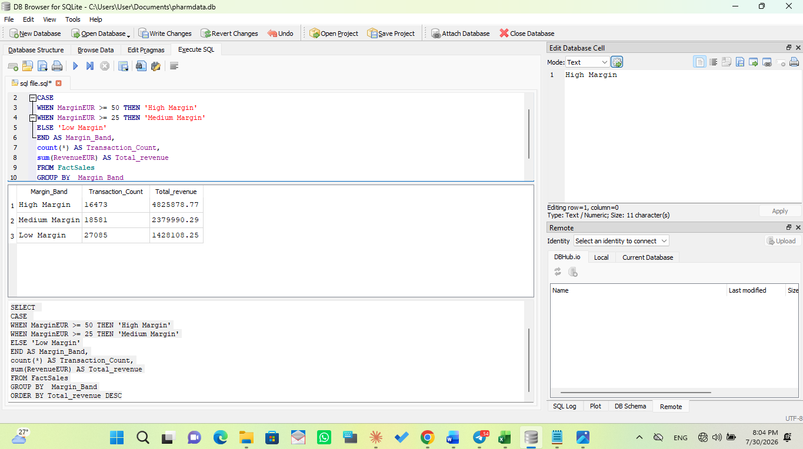
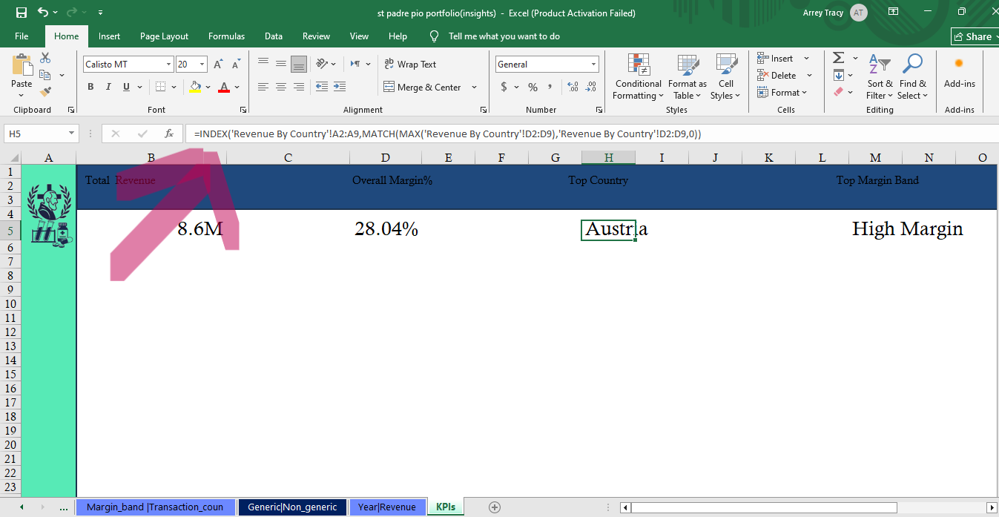

# St Padre Pio Pharma — SQL & Excel Sales Analysis

A SQL and Excel analysis of a pharmacy retail sales dataset, built around a specific set of business questions.

St Padre Pio Pharma is a fictional company created for this portfolio — the dataset was shaped and cleaned specifically to answer real business questions, the same way a working analyst would approach a stakeholder request.

## Business Questions

This analysis was driven by five specific questions, decided before writing any SQL:

1. Which country is contributing most to profit?
2. Are promotions actually helping the business?
3. What is the impact of discontinued products on revenue?
4. Are generic drug forms selling more than branded ones?
5. What is the margin % across the business, and where does it vary?

## Approach

1. SQL — used not just to extract data, but to clean it and shape it specifically toward the five questions above, on a star-schema dataset (`FactSales`, DimDate, DimPharmacy, `DimProduct`) in DB Browser for SQLite.
2. Excel — exported the cleaned query results into Excel to build a KPI-driven dashboard, with a dedicated Insights page explaining what each chart shows and why it matters.

## SQL Analysis

📄 [Download the SQL file](sql%20file.sql?raw=true)

## Excel Dashboard

KPIs were used to summarize key findings at a glance, backed by an Insights page that walks through each chart's takeaway.

Sample KPI:

📊 [Download the Excel workbook](st%20padre%20pio%20portfolio%28insights%29.xlsx?raw=true)

## Key Findings

- Country profitability — profit contribution varies meaningfully by country (see Insights page for the exact ranking)
- Promotions — promotional pricing measurably reduces margin %, with limited evidence of a volume trade-off worth the discount
- Discontinued products — revenue from discontinued products declines sharply over time, contributing to slower overall growth
- Generic vs. brand — sales volume and margin differ notably between generic and branded product forms
- Margin % — calculated and broken down across multiple dimensions to identify where profitability is strongest and weakest

*(Full numbers and chart-by-chart explanations are in the workbook's Insights page.)*

## Skills Demonstrated

- SQL (query writing, data cleaning, business-question-driven analysis)
- Excel (KPI design, formulas, dashboard building)
- Data cleaning (both SQL and Excel)
- Data storytelling (Insights page)
- Business acumen (translating stakeholder questions into an analysis plan)

## Author

Arrey Tracy — 5th year of 7, Doctoral student of Pharmaceutical science, focused on health-sector data roles.
